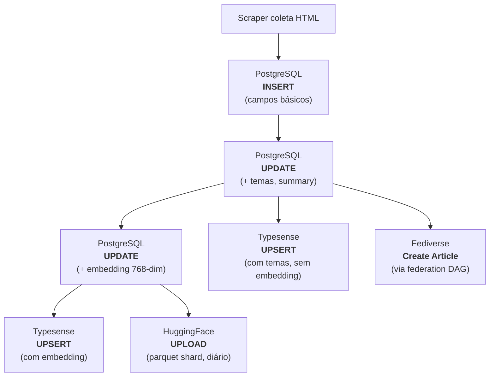

# Dados e Armazenamento

O pipeline utiliza três stores complementares, cada um otimizado para um caso de uso diferente.

| Store | Função | Tecnologia | Acesso |
|-------|--------|------------|--------|
| **PostgreSQL** | Fonte de verdade | Cloud SQL | Interno (VPC) |
| **Typesense** | Busca (full-text + vetorial) | Compute Engine | Portal |
| **HuggingFace** | Dados abertos | HuggingFace Hub | Público |

## Ciclo de Vida de um Artigo



## PostgreSQL (Fonte de Verdade)

### Infraestrutura

- **Serviço**: Google Cloud SQL
- **Versão**: PostgreSQL 15
- **Extension**: pgvector (para embeddings)
- **Databases**: `govbrnews` (principal) + `federation` (ActivityPub)

### Tabela `news` (principal)

| Campo | Tipo | Descrição |
|-------|------|-----------|
| `id` | serial | PK auto-increment |
| `unique_id` | varchar | Hash MD5 (agency + date + title), unique |
| `agency_id` | integer | FK para `agencies` |
| `agency_key` | varchar | Slug do órgão (ex: `mec`) |
| `agency_name` | varchar | Nome completo do órgão |
| `published_at` | timestamp | Data de publicação original |
| `extracted_at` | timestamp | Quando foi coletado |
| `title` | text | Título da notícia |
| `subtitle` | text | Subtítulo |
| `editorial_lead` | text | Linha fina |
| `url` | text | URL original no gov.br |
| `content` | text | Conteúdo em Markdown |
| `image_url` | text | URL da imagem principal |
| `video_url` | text | URL de vídeo (opcional) |
| `category` | varchar | Categoria original do site |
| `tags` | jsonb | Tags originais |
| `theme_l1_id` | integer | Tema nível 1 (classificação LLM) |
| `theme_l2_id` | integer | Tema nível 2 |
| `theme_l3_id` | integer | Tema nível 3 |
| `most_specific_theme_id` | integer | Tema mais específico (L3 > L2 > L1) |
| `summary` | text | Resumo gerado por LLM |
| `content_embedding` | vector(768) | Embedding vetorial (pgvector) |
| `embedding_generated_at` | timestamp | Quando o embedding foi gerado |

### Exemplo de Registro Completo

```json
{
  "id": 123456,
  "unique_id": "abc123def456",
  "agency_key": "mec",
  "agency_name": "Ministério da Educação",
  "published_at": "2026-02-28T10:00:00Z",
  "title": "MEC anuncia programa de bolsas",
  "content": "# MEC anuncia programa...\n\nConteúdo completo...",
  "theme_l1_id": 1,
  "theme_l2_id": 5,
  "most_specific_theme_id": 5,
  "summary": "O MEC lançou um programa de bolsas...",
  "content_embedding": [0.123, -0.456, ...],
  "embedding_generated_at": "2026-02-28T10:00:05Z"
}
```

### Tabelas Auxiliares

| Tabela | Função |
|--------|--------|
| `agencies` | Cadastro de órgãos (159 ativos) |
| `themes` | Árvore temática em 3 níveis (~410 categorias) |
| `sync_log` | Log de operações de sync |

### Database Federation

| Tabela | Função |
|--------|--------|
| `ap_actors` | 185 atores ActivityPub com chaves RSA/Ed25519 |
| `ap_followers` | Seguidores remotos |
| `ap_publish_queue` | Fila de publicação (preenchida pela DAG) |
| `ap_activities` | Log de atividades publicadas |
| `ap_delivery_log` | Rastreamento de entregas |
| `ap_dead_servers` | Servidores inacessíveis (blacklist) |
| `ap_sync_watermark` | Checkpoint da DAG (singleton) |

## Typesense (Busca)

### Infraestrutura

- **Serviço**: Typesense Server
- **Host**: Compute Engine (GCP)
- **Collection**: `news`
- **Busca**: Full-text + vetorial (hybrid search)

### Schema da Collection `news`

Campos indexados para busca:

| Campo | Tipo | Facetável | Busca |
|-------|------|-----------|-------|
| `title` | string | Não | Full-text |
| `content` | string | Não | Full-text |
| `summary` | string | Não | Full-text |
| `agency_name` | string | Sim | Filtro |
| `agency_key` | string | Sim | Filtro |
| `most_specific_theme_name` | string | Sim | Filtro |
| `published_at` | int64 | Sim | Sort/Filtro |
| `content_embedding` | float[] | Não | Vetorial (768-dim) |

### Modos de Busca

O portal usa **hybrid search** combinando:

1. **Full-text**: BM25 sobre `title`, `content`, `summary`
2. **Vetorial**: Cosine similarity sobre `content_embedding`

O Typesense combina os scores automaticamente via `rank_fusion`.

### Atualização

| Método | Trigger | Frequência |
|--------|---------|------------|
| **Real-time** | Pub/Sub (enriched + embedded) | Cada artigo novo |
| **Incremental** | CLI `data-platform sync-typesense` | Sob demanda |
| **Full reload** | Workflow `typesense-full-reload.yaml` | Manual (destrutivo) |

## HuggingFace (Dados Abertos)

### Datasets

| Dataset | Colunas | Descrição |
|---------|---------|-----------|
| [`nitaibezerra/govbrnews`](https://huggingface.co/datasets/nitaibezerra/govbrnews) | 24 | Dataset completo |
| [`nitaibezerra/govbrnews-reduced`](https://huggingface.co/datasets/nitaibezerra/govbrnews-reduced) | 4 | Versão reduzida (id, title, content, agency) |

### Formato

- **Armazenamento**: Parquet shards incrementais
- **Naming**: `data/train-YYYY-MM-DD-HHMMSS.parquet`
- **Atualização**: Diária via DAG Airflow (6AM UTC)
- **Deduplicação**: Via Dataset Viewer API (consulta IDs existentes sem baixar o dataset)

### Colunas do Dataset Completo

As 24 colunas incluem todos os campos da tabela `news` no PostgreSQL, exceto `content_embedding` (vetor muito grande para distribuição como dataset).

## Links

- [PostgreSQL (docs principal)](https://destaquesgovbr.github.io/docs/arquitetura/postgresql) — Schema completo
- [Árvore Temática (docs principal)](https://destaquesgovbr.github.io/docs/modulos/arvore-tematica) — Taxonomia de 3 níveis
- [Pipeline Real-Time](pipeline-realtime.md) — Como os dados fluem
