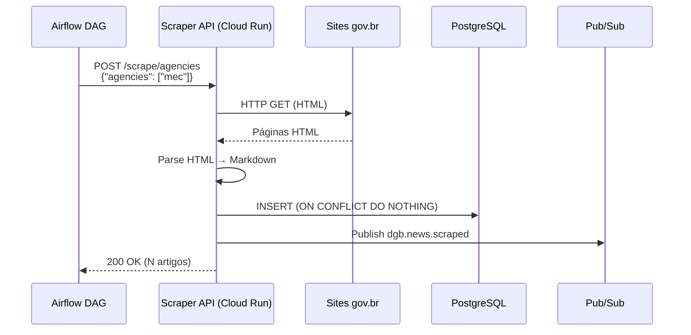
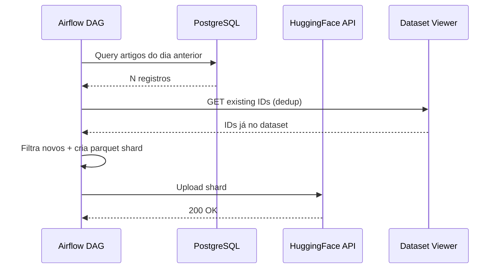
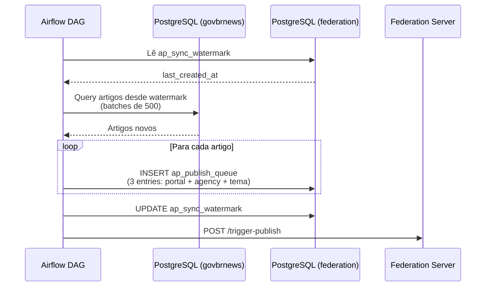

# Pipeline Batch

> Processos agendados via Apache Airflow (Google Cloud Composer).

## Visão Geral

O pipeline batch complementa o [pipeline real-time](pipeline-realtime.md) com operações que são naturalmente periódicas ou que envolvem processamento em volume.

| Pipeline | Schedule | Função |
|----------|----------|--------|
| Scraper Trigger | Cada 15 minutos | Dispara coleta de notícias |
| HuggingFace Sync | Diário, 6AM UTC | Exporta dataset aberto |
| Federation Publish | Cada 10 minutos | Publica no Fediverse |

## Scraper Trigger

~158 DAGs no Airflow disparam a Scraper API via HTTP POST. O Airflow atua como **orquestrador** — a execução pesada acontece no Cloud Run.



### Decisão: orquestrar, não executar

!!! info "Lição aprendida"
    Inicialmente, o scraper rodava **dentro** do Composer como dependência Python. O ciclo de deploy de 10-20 minutos para cada atualização de requirements tornou isso inviável. A solução: DAGs de 2 linhas que fazem HTTP POST para o Cloud Run. Workers leves, scraper isolado.

### Configuração das DAGs

- **Schedule**: `*/15 * * * *` (a cada 15 minutos)
- **Retry**: 2x com backoff exponencial de 5 minutos
- **Timeout**: 15 minutos
- **Concurrency**: `max_active_runs=1` por DAG
- **Auth**: IAM token (Workload Identity)

Cada agência tem sua própria DAG (`scrape_mec`, `scrape_mpa`, etc.), permitindo monitoramento e retry independentes.

## HuggingFace Sync

DAG diária que exporta novos artigos como dataset aberto no HuggingFace.



### Configuração

- **DAG**: `sync_postgres_to_huggingface`
- **Repo**: `data-publishing`
- **Schedule**: `0 6 * * *` (6AM UTC)
- **Datasets**:
    - Full (24 colunas): [`nitaibezerra/govbrnews`](https://huggingface.co/datasets/nitaibezerra/govbrnews)
    - Reduzido (4 colunas): [`nitaibezerra/govbrnews-reduced`](https://huggingface.co/datasets/nitaibezerra/govbrnews-reduced)
- **Formato**: Parquet shards incrementais (`data/train-YYYY-MM-DD-HHMMSS.parquet`)
- **Deduplicação**: Via Dataset Viewer API (evita baixar dataset inteiro)

### Connections Airflow

| Connection | Tipo | Uso |
|-----------|------|-----|
| `postgres_default` | PostgreSQL | Leitura de artigos |
| `huggingface_default` | Generic | Token HF no campo password |

## Federation Publish

DAG que alimenta a fila de publicação do servidor ActivityPub.



### Configuração

- **DAG**: `federation_publish`
- **Repo**: `activitypub-server`
- **Schedule**: `*/10 * * * *` (cada 10 minutos)
- **max_active_runs**: 1
- **Batch size**: 500 artigos por iteração
- **Actors por artigo**: 3 (portal + agência + tema)

### 185 Actors ActivityPub

O servidor mantém 185 atores:

- 1 conta `portal` (principal)
- 159 contas de agência (`mec`, `mpa`, etc.)
- 25 contas temáticas (`tema-educacao`, `tema-saude`, etc.)

Cada artigo é publicado por até 3 atores, permitindo que usuários do Fediverse sigam um órgão ou tema específico.

### Watermark

A DAG usa um watermark (`ap_sync_watermark`) para processar apenas artigos novos. O watermark é atualizado após cada batch, garantindo **resumabilidade** em caso de falha.

## Infraestrutura Airflow

O Cloud Composer executa todos os DAGs batch:

| Config | Valor |
|--------|-------|
| **Composer version** | 2.x |
| **Airflow version** | 2.x |
| **Region** | us-central1 |
| **Workloads** | Small (default) |
| **DAGs total** | ~162 |
| **Bucket GCS** | `us-central1-destaquesgovbr--*-bucket` |

### Deploy de DAGs

Cada repo deploya suas DAGs em um subdiretório próprio no bucket GCS do Composer via `gsutil rsync`:

```
dags/
├── scraper/          # repo: scraper
├── data-publishing/  # repo: data-publishing
├── activitypub/      # repo: activitypub-server
└── data-platform/    # repo: data-platform
```

Deploy automatizado via [reusable workflow](https://github.com/destaquesgovbr/reusable-workflows) `composer-deploy-dags.yml`.

## Links

- [Pipeline Real-Time](pipeline-realtime.md) — Pipeline event-driven
- [Airflow DAGs (docs principal)](https://destaquesgovbr.github.io/docs/workflows/airflow-dags) — Config detalhada do Composer
- [Componente: Scraper](../componentes/scraper.md)
- [Componente: Data Publishing](../componentes/data-publishing.md)
- [Componente: Federation](../componentes/federation.md)
