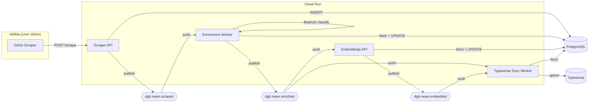

# Pipeline Real-Time (Event-Driven)

> Processamento near-real-time via Google Cloud Pub/Sub + Cloud Run Workers.

## Motivação

O pipeline batch anterior tinha latência de até **24 horas** entre o scraping e a disponibilidade no portal. Cada etapa rodava em schedule fixo, independente de haver dados novos.

Com a arquitetura event-driven implementada em fevereiro/2026, a latência caiu para **~5 segundos**.

## Arquitetura



## Topics e Subscriptions

### Topics Pub/Sub

| Topic | Publisher | Payload |
|-------|-----------|---------|
| `dgb.news.scraped` | Scraper API | `unique_id`, `agency_key`, `published_at`, `scraped_at` |
| `dgb.news.enriched` | Enrichment Worker | `unique_id`, `enriched_at`, `most_specific_theme_code`, `has_summary` |
| `dgb.news.embedded` | Embeddings API | `unique_id`, `embedded_at`, `embedding_dim` |

Todas as mensagens incluem atributos `trace_id` (UUID) e `event_version` ("1.0").

### Subscriptions (Push)

| Subscription | Topic | Subscriber | Ack Deadline |
|-------------|-------|-----------|-------------|
| `dgb.news.scraped--enrichment` | scraped | Enrichment Worker | 600s |
| `dgb.news.enriched--typesense` | enriched | Typesense Sync Worker | 120s |
| `dgb.news.enriched--embeddings` | enriched | Embeddings API | 600s |
| `dgb.news.embedded--typesense-update` | embedded | Typesense Sync Worker | 120s |

Cada subscription tem uma **Dead-Letter Queue** (DLQ) para mensagens que falham apos o maximo de tentativas.

### Schema das Mensagens

=== "dgb.news.scraped"

    ```json
    {
      "unique_id": "mec-2026-02-27-titulo",
      "agency_key": "mec",
      "published_at": "2026-02-27T14:30:00Z",
      "scraped_at": "2026-02-27T15:00:00Z"
    }
    ```

=== "dgb.news.enriched"

    ```json
    {
      "unique_id": "mec-2026-02-27-titulo",
      "enriched_at": "2026-02-27T15:02:00Z",
      "most_specific_theme_code": "01.02.03",
      "has_summary": true
    }
    ```

=== "dgb.news.embedded"

    ```json
    {
      "unique_id": "mec-2026-02-27-titulo",
      "embedded_at": "2026-02-27T15:05:00Z",
      "embedding_dim": 768
    }
    ```

## Timeline de Latência

```
t=0:00  Scraper API insere artigo no PostgreSQL
t=0:00  Publica dgb.news.scraped
t=0:01  Enrichment Worker recebe push
t=0:04  Bedrock classifica + gera summary
t=0:04  UPDATE PostgreSQL + publica dgb.news.enriched
t=0:05  Typesense Sync Worker upsert (com temas, sem embedding)
t=0:05  Embeddings API recebe push
t=0:05  Modelo local gera vetor 768-dim
t=0:05  UPDATE PostgreSQL + publica dgb.news.embedded
t=0:05  Typesense Sync Worker atualiza com embedding

Total: ~5 segundos (validado em produção, 28/fev/2026)
```

!!! note "Latência vs. design original"
    O design original previa ~13 segundos. Em produção, medimos **~5 segundos** graças ao cold start rápido dos workers e ao uso do modelo local de embeddings (sem HTTP hop).

## Idempotência

Todos os workers são seguros para re-delivery (at-least-once do Pub/Sub):

| Worker | Verificação | Comportamento |
|--------|-------------|---------------|
| Enrichment | `most_specific_theme_id IS NOT NULL` | Skip se já classificado |
| Embeddings | `content_embedding IS NOT NULL` | Skip se já tem embedding |
| Typesense Sync | Upsert | Inerentemente idempotente |

## Tratamento de Erros

### Estratégia ACK-always

Todos os workers retornam **HTTP 200** mesmo em caso de erro de processamento. Isso evita retries infinitos do Pub/Sub para artigos com problemas (conteúdo vazio, idioma não suportado).

Erros são logados com `unique_id` e `trace_id` para investigação.

### Dead-Letter Queues

Mensagens que falham após o máximo de tentativas (configurado por subscription) vão para DLQ topics separados. Um alerta dispara quando há mensagens na DLQ.

### DAG de Reconciliação

Uma DAG Airflow diária atua como safety net, capturando artigos que passaram pelo scraping mas não foram processados:

```sql
SELECT unique_id FROM news
WHERE most_specific_theme_id IS NULL
  AND published_at > NOW() - INTERVAL '2 days'
```

Artigos encontrados são republicados no `dgb.news.scraped`.

## Decisão: Scraper publica diretamente

O scraper publica no Pub/Sub após INSERT bem-sucedido, sem CDC (Change Data Capture). Motivos:

1. O scraper já controla os INSERTs e usa `ON CONFLICT DO NOTHING`
2. Se o publish falhar, o artigo já está no PostgreSQL e será capturado pela DAG de reconciliação
3. Evita complexidade de Debezium/pg_notify

## Links

- [Referência completa (docs principal)](https://destaquesgovbr.github.io/docs/arquitetura/pubsub-workers) — Topics, workers e CI/CD
- [Tutorial Cloud Pub/Sub](https://destaquesgovbr.github.io/docs/onboarding/cloud-pubsub-tutorial) — Onboarding
- [Componente: Enrichment](../componentes/enrichment.md)
- [Componente: Embeddings](../componentes/embeddings.md)
- [Componente: Typesense Sync](../componentes/typesense-sync.md)
