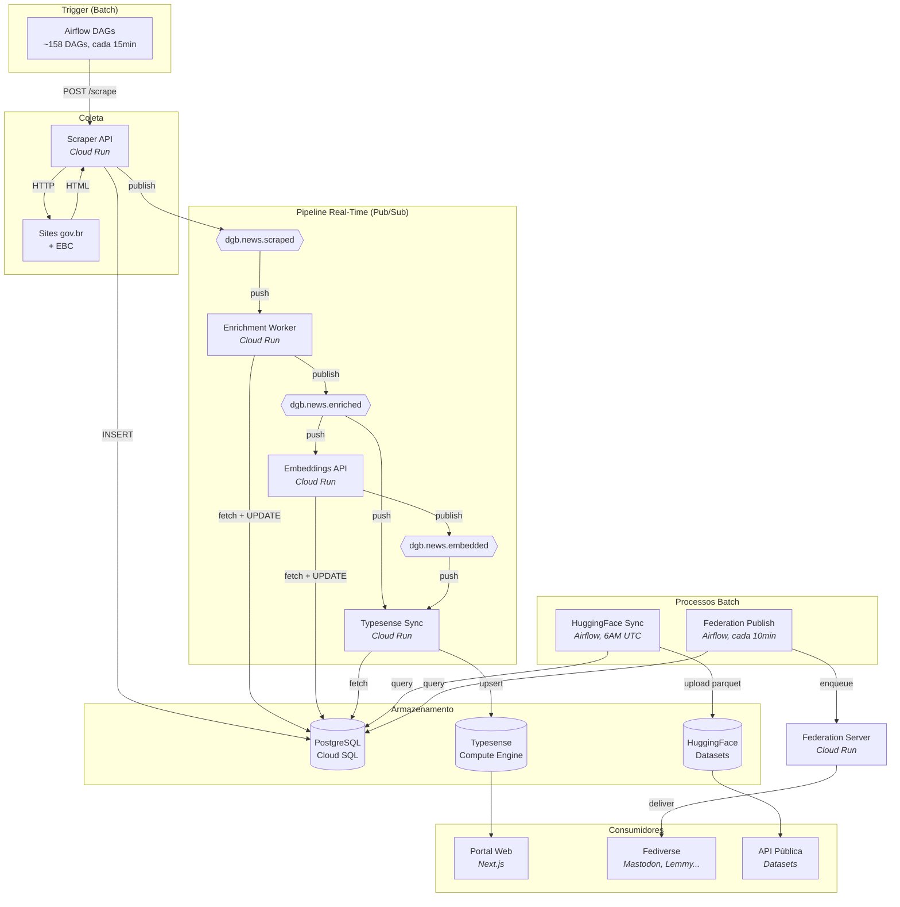
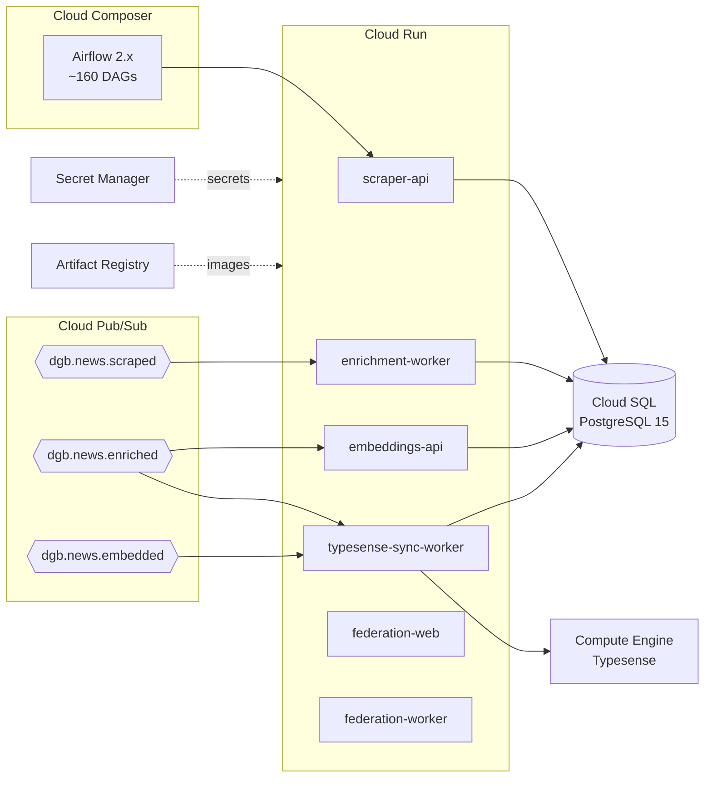

# Visão Geral da Arquitetura

O pipeline de dados do DGB combina processamento **event-driven** (near real-time) com **batch** (agendado), usando o PostgreSQL como fonte de verdade central.

## Diagrama Unificado

## Comparação de Latência

| Caminho | Modo | Latência | Detalhes |
|---------|------|----------|----------|
| Scrape → Portal (busca) | Real-time | **~5 segundos** | Pub/Sub push chain |
| Scrape → Portal (homepage) | Real-time + ISR | ~10 minutos | ISR revalidate=600s |
| Scrape → HuggingFace | Batch | ~24 horas | DAG diária 6AM UTC |
| Scrape → Fediverse | Batch | ~25 minutos | DAG cada 10min + delay |

## Infraestrutura GCP

Todos os recursos são provisionados via Terraform no repo [`infra`](https://github.com/destaquesgovbr/infra).

## Serviços Cloud Run

| Serviço | Repo | vCPU | RAM | Min/Max Instâncias | Timeout |
|---------|------|------|-----|---------------------|---------|
| `destaquesgovbr-scraper-api` | scraper | 1 | 1Gi | 0/3 | 900s |
| `destaquesgovbr-enrichment-worker` | data-science | 1 | 1Gi | 0/3 | 900s |
| `destaquesgovbr-embeddings-api` | embeddings | 2 | 4Gi | 0/1 | 600s |
| `destaquesgovbr-typesense-sync-worker` | data-platform | 1 | 512Mi | 0/3 | 300s |
| `destaquesgovbr-federation-web` | activitypub-server | 1 | 512Mi | 0/5 | 300s |
| `destaquesgovbr-federation-worker` | activitypub-server | 1 | 512Mi | 1/2 | — |

Todos usam **scale-to-zero** (min=0), exceto o federation-worker que precisa estar sempre ativo para processar a fila Fedify.

## Repositórios e Responsabilidades

| Repo | Responsabilidade | Serviço Cloud Run | Linguagem |
|------|------------------|-------------------|-----------|
| `scraper` | Coleta de notícias gov.br + EBC | scraper-api | Python (FastAPI) |
| `data-science` | Classificação temática + resumo | enrichment-worker | Python (FastAPI) |
| `embeddings` | Embeddings vetoriais 768-dim | embeddings-api | Python (FastAPI) |
| `data-platform` | Sync Typesense, CLI, managers | typesense-sync-worker | Python (FastAPI) |
| `data-publishing` | Export para HuggingFace | — (DAG Airflow) | Python |
| `activitypub-server` | Federação ActivityPub | federation-web + worker | Node.js (Hono + Fedify) |
| `infra` | Terraform (todos os recursos GCP) | — | HCL |

## Links

- [Pipeline Real-Time](pipeline-realtime.md) — Deep-dive no pipeline event-driven
- [Pipeline Batch](pipeline-batch.md) — Deep-dive nos processos agendados
- [Dados e Armazenamento](dados-e-armazenamento.md) — PostgreSQL, Typesense, HuggingFace
- [Documentação principal do DGB](https://destaquesgovbr.github.io/docs/arquitetura/visao-geral)
