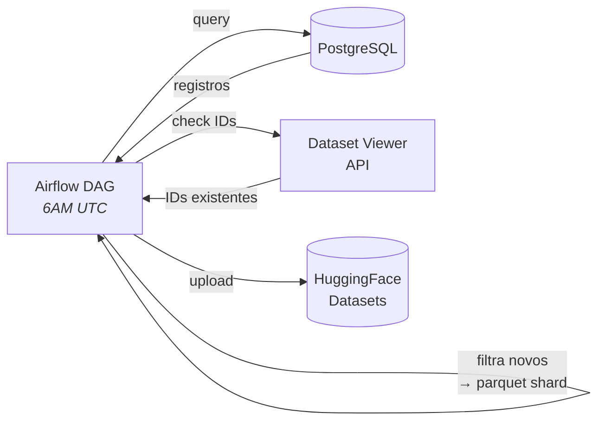

# Publicação HuggingFace

> Exportação diária de notícias como dataset aberto no HuggingFace.

## O que faz

A DAG `sync_postgres_to_huggingface` exporta novos artigos do PostgreSQL para o HuggingFace em formato Parquet, mantendo dois datasets públicos atualizados: um completo (24 colunas) e um reduzido (4 colunas).

## Como funciona

### Fluxo detalhado

1. Query artigos do dia anterior no PostgreSQL
2. Consulta IDs existentes via HuggingFace Dataset Viewer API (dedup sem download)
3. Filtra apenas artigos novos
4. Cria parquet shard com schema tipado (PyArrow)
5. Upload para ambos os datasets

## Onde mora

**Repo**: [`destaquesgovbr/data-publishing`](https://github.com/destaquesgovbr/data-publishing)

| Arquivo | Conteúdo |
|---------|----------|
| `dags/sync_postgres_to_huggingface.py` | DAG principal |
| `src/data_publishing/hf/schema.py` | Schema PyArrow + mapeamento de colunas |
| `src/data_publishing/hf/dedup.py` | Deduplicação via Dataset Viewer API |
| `src/data_publishing/hf/uploader.py` | Upload de parquet para HF |
| `src/data_publishing/hf/readme_sanitizer.py` | Limpeza de splits obsoletos no README |

## Datasets

| Dataset | Colunas | URL |
|---------|---------|-----|
| Full | 24 | [`nitaibezerra/govbrnews`](https://huggingface.co/datasets/nitaibezerra/govbrnews) |
| Reduzido | 4 | [`nitaibezerra/govbrnews-reduced`](https://huggingface.co/datasets/nitaibezerra/govbrnews-reduced) |

## Configuração

| Variável | Descrição |
|----------|-----------|
| Airflow Connection `postgres_default` | PostgreSQL (Cloud SQL) |
| Airflow Connection `huggingface_default` | Token HF no campo password |

### Config da DAG

| Config | Valor |
|--------|-------|
| **Schedule** | `0 6 * * *` (6AM UTC) |
| **Catchup** | Desabilitado |
| **Retries** | 3, backoff exponencial |
| **Formato** | Parquet shards: `data/train-YYYY-MM-DD-HHMMSS.parquet` |

## Links

- [Pipeline Batch](../arquitetura/pipeline-batch.md)
- [Dados e Armazenamento](../arquitetura/dados-e-armazenamento.md) — Seção HuggingFace
