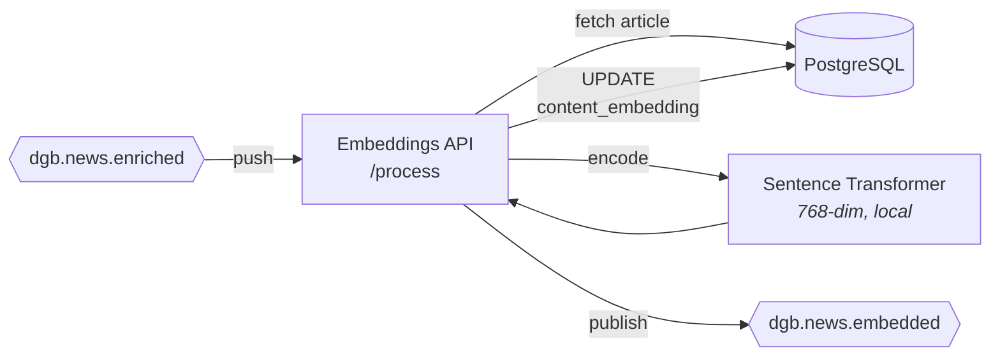

# Embeddings

> Geração de embeddings vetoriais 768-dim com modelo sentence-transformer local.

## O que faz

O Embeddings API gera representações vetoriais dos artigos usando o modelo `paraphrase-multilingual-mpnet-base-v2`. Os vetores são usados para busca semântica no Typesense (hybrid search).

## Como funciona

### Fluxo detalhado

1. Recebe push do Pub/Sub em `POST /process`
2. **Verifica idempotência**: `content_embedding IS NOT NULL` → skip
3. Busca `title`, `summary` e `content` do PostgreSQL
4. Prepara texto via `prepare_text_for_embedding()`
5. Gera embedding 768-dim com o modelo local
6. Atualiza `content_embedding` no PostgreSQL (pgvector)
7. Publica `dgb.news.embedded`

!!! note "Decisão: endpoint na API existente"
    O `/process` foi adicionado ao Embeddings API existente (que já tinha `/generate` para chamadas REST). Isso evita um HTTP hop Cloud Run → Cloud Run e aproveita o modelo ML já carregado em memória.

## Onde mora

**Repo**: [`destaquesgovbr/embeddings`](https://github.com/destaquesgovbr/embeddings)

| Arquivo | Conteúdo |
|---------|----------|
| `src/embeddings_api/main.py` | FastAPI app |
| `src/embeddings_api/pubsub_handler.py` | Handler do `/process` (Pub/Sub) |
| `src/embeddings_api/embedding_service.py` | Carrega modelo + gera embeddings |
| `src/embeddings_api/auth.py` | Autenticação por API key |
| `src/embeddings_client/text_prep.py` | Preparação de texto para embedding |

## API Endpoints

| Método | Path | Descrição | Auth |
|--------|------|-----------|------|
| `POST` | `/generate` | Gera embeddings para lista de textos | API Key |
| `POST` | `/process` | Handler Pub/Sub (push) | OIDC (Pub/Sub SA) |
| `GET` | `/health` | Health check | Nenhuma |

## Configuração

| Variável | Descrição |
|----------|-----------|
| `DATABASE_URL` | Connection string PostgreSQL |
| `PUBSUB_TOPIC_NEWS_EMBEDDED` | Topic para publicação |
| `EMBEDDINGS_API_KEY` | API key para endpoint `/generate` |

## Modelo

| Config | Valor |
|--------|-------|
| **Modelo** | `sentence-transformers/paraphrase-multilingual-mpnet-base-v2` |
| **Dimensões** | 768 |
| **Tipo** | Sentence-level embedding |
| **Linguagens** | 50+ (incluindo português) |
| **Carregamento** | Na inicialização do container (in-memory) |

## Specs

| Config | Valor |
|--------|-------|
| **Cloud Run Service** | `destaquesgovbr-embeddings-api` |
| **vCPU** | 2 |
| **RAM** | 4Gi |
| **Min/Max Instâncias** | 0/1 |
| **Timeout** | 600s |
| **Scale-to-zero** | Sim |

!!! info "RAM alta por causa do modelo ML"
    O modelo sentence-transformer ocupa ~1.5Gi em memória. Com 4Gi de RAM, há margem para o framework e processamento de texto.

## Idempotência

Artigos com embedding existente (`content_embedding IS NOT NULL`) são ignorados.

## Links

- [Pipeline Real-Time](../arquitetura/pipeline-realtime.md) — Contexto do pipeline
- [Dados e Armazenamento](../arquitetura/dados-e-armazenamento.md) — pgvector no PostgreSQL
