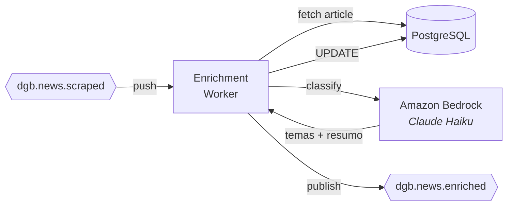

# Enriquecimento LLM

> Classificação temática e geração de resumos via Amazon Bedrock (Claude Haiku).

## O que faz

O Enrichment Worker recebe eventos de artigos recém-coletados, classifica cada artigo em uma hierarquia temática de 3 níveis (~410 categorias) e gera um resumo. Usa o modelo Claude Haiku via Amazon Bedrock.

## Como funciona

### Fluxo detalhado

1. Recebe push do Pub/Sub em `POST /process`
2. Decodifica envelope Pub/Sub, extrai `unique_id`
3. **Verifica idempotência**: `most_specific_theme_id IS NOT NULL` → skip
4. Busca artigo completo do PostgreSQL
5. Chama `NewsClassifier.classify_single()` (Bedrock Claude Haiku)
    - Classifica em tema nível 1, 2 e 3
    - Gera resumo em português
6. Calcula `most_specific_theme` (prioridade: L3 > L2 > L1)
7. Atualiza PostgreSQL com temas e summary
8. Publica `dgb.news.enriched`
9. Retorna HTTP 200 (ACK)

## Onde mora

**Repo**: [`destaquesgovbr/data-science`](https://github.com/destaquesgovbr/data-science)

| Arquivo | Conteúdo |
|---------|----------|
| `src/news_enrichment/worker/app.py` | FastAPI com `/process` e `/health` |
| `src/news_enrichment/worker/handler.py` | `enrich_article()`, parse AWS creds, publish |
| `source/news-enrichment/news_enrichment/classifier.py` | `NewsClassifier` — prompt + Bedrock call |
| `source/news-enrichment/news_enrichment/llm_client.py` | Cliente AWS Bedrock |

## Configuração

| Variável | Descrição |
|----------|-----------|
| `DATABASE_URL` | Connection string PostgreSQL |
| `AWS_BEDROCK_CONNECTION_URI` | URI estilo Airflow: `aws://KEY:SECRET@/?region_name=us-east-1` |
| `BEDROCK_MODEL_ID` | Modelo (default: `anthropic.claude-3-haiku-20240307-v1:0`) |
| `PUBSUB_TOPIC_NEWS_ENRICHED` | Topic para publicação |

!!! warning "URL-encoding nas credenciais AWS"
    O `AWS_BEDROCK_CONNECTION_URI` usa formato Airflow onde caracteres especiais no secret key são URL-encoded (`%2F` para `/`, `%2B` para `+`). O handler faz `unquote()` automaticamente.

## Taxonomia

A classificação usa uma árvore temática de 3 níveis com ~410 categorias:

- **Nível 1**: Macro-temas (ex: Educação, Saúde, Economia)
- **Nível 2**: Sub-temas (ex: Ensino Superior, Atenção Básica)
- **Nível 3**: Temas específicos (ex: Bolsas de Estudo, Vacinação)

A taxonomia é carregada do PostgreSQL (tabela `themes`) na inicialização do worker.

## Specs

| Config | Valor |
|--------|-------|
| **Cloud Run Service** | `destaquesgovbr-enrichment-worker` |
| **vCPU** | 1 |
| **RAM** | 1Gi |
| **Min/Max Instâncias** | 0/3 |
| **Timeout** | 900s |
| **Scale-to-zero** | Sim |

## Idempotência

Artigos já classificados (`most_specific_theme_id IS NOT NULL`) são ignorados automaticamente, tornando o worker seguro para re-delivery do Pub/Sub.

## Links

- [Pipeline Real-Time](../arquitetura/pipeline-realtime.md) — Contexto do pipeline
- [Árvore Temática (docs principal)](https://destaquesgovbr.github.io/docs/modulos/arvore-tematica)
