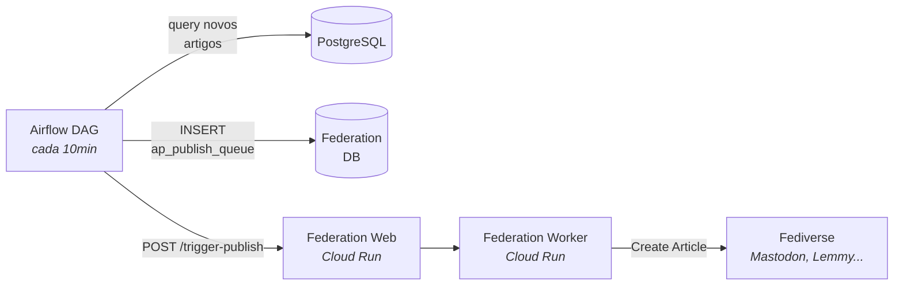

# Federação ActivityPub

> Publicação de notícias governamentais no Fediverse via protocolo ActivityPub.

## O que faz

O sistema de federação publica notícias no Fediverse (Mastodon, Lemmy, Misskey, GoToSocial, etc.) através de 185 atores ActivityPub. Cada artigo é publicado por até 3 atores: a conta principal do portal, a conta do órgão e a conta do tema.

## Como funciona

### Fluxo detalhado

1. DAG `federation_publish` lê `ap_sync_watermark` (checkpoint)
2. Query artigos novos desde watermark (batches de 500)
3. Para cada artigo, cria 3 entries na `ap_publish_queue`:
    - Actor `portal` (conta principal)
    - Actor `{agency_key}` (ex: `mec`)
    - Actor `tema-{theme_code}` (ex: `tema-educacao`)
4. Atualiza watermark com `last_created_at`
5. `POST /trigger-publish` no Federation Server
6. Server processa fila via Fedify queue
7. Cria atividade `Create{Article}` por actor
8. Worker entrega para instâncias remotas que seguem os atores

## Onde mora

**Repo**: [`destaquesgovbr/activitypub-server`](https://github.com/destaquesgovbr/activitypub-server)

### DAG (Python)

| Arquivo | Conteúdo |
|---------|----------|
| `dags/federation_publish.py` | DAG de enfileiramento |

### Server (Node.js)

| Stack | Versão |
|-------|--------|
| **Runtime** | Node.js 22 |
| **Framework** | Hono |
| **ActivityPub** | Fedify 1.10 |
| **ORM** | Drizzle |

### Endpoints

| Método | Path | Descrição | Acesso |
|--------|------|-----------|--------|
| `GET` | `/.well-known/webfinger` | Discovery | Público |
| `GET` | `/ap/actors/{id}` | Perfil do ator | Público |
| `GET` | `/ap/actors/{id}/outbox` | Outbox | Público |
| `GET` | `/ap/actors/{id}/followers` | Seguidores | Público |
| `POST` | `/ap/actors/{id}/inbox` | Inbox (recebe follows) | Público |
| `POST` | `/ap/inbox` | Shared inbox | Público |
| `POST` | `/trigger-publish` | Trigger publicação | Interno (token) |
| `GET` | `/health` | Health check | Público |

## 185 Atores

| Tipo | Quantidade | Exemplo |
|------|------------|---------|
| Portal | 1 | `portal` |
| Agências | 159 | `mec`, `mpa`, `saude` |
| Temas | 25 | `tema-educacao`, `tema-saude` |

Cada ator tem par de chaves RSA e Ed25519 para assinatura HTTP Signatures.

## Database Federation

| Tabela | Função |
|--------|--------|
| `ap_actors` | 185 atores com chaves criptográficas |
| `ap_followers` | Seguidores remotos |
| `ap_publish_queue` | Fila de publicação |
| `ap_activities` | Log de atividades |
| `ap_delivery_log` | Rastreamento de entregas |
| `ap_dead_servers` | Servidores inacessíveis |
| `ap_sync_watermark` | Checkpoint da DAG |

## Configuração

### DAG Airflow

| Config | Valor |
|--------|-------|
| **Schedule** | `*/10 * * * *` |
| **max_active_runs** | 1 |
| **Batch size** | 500 artigos |

### Cloud Run

| Serviço | vCPU | RAM | Min/Max |
|---------|------|-----|---------|
| `federation-web` | 1 | 512Mi | 0/5 |
| `federation-worker` | 1 | 512Mi | 1/2 |

!!! info "Worker sempre ativo"
    O federation-worker tem `min_instance_count=1` porque precisa estar sempre pronto para processar a fila Fedify. É o único serviço do pipeline que não usa scale-to-zero.

## Watermark e Resumabilidade

A DAG usa um watermark (tabela `ap_sync_watermark`, singleton) para processar apenas artigos novos. O watermark é atualizado após cada batch de 500, garantindo que falhas no meio do processamento podem ser retomadas sem duplicação.

## Links

- [Pipeline Batch](../arquitetura/pipeline-batch.md) — DAG federation_publish
- [Dados e Armazenamento](../arquitetura/dados-e-armazenamento.md) — Database federation
