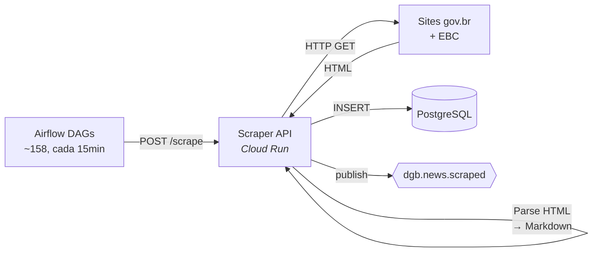

# Scraper

> Coleta de notícias de 158+ sites gov.br e EBC.

## O que faz

O Scraper é o ponto de entrada do pipeline. Coleta notícias de sites governamentais, converte HTML para Markdown e persiste no PostgreSQL. Após cada inserção, publica um evento no Pub/Sub para acionar o pipeline real-time.

## Como funciona

### Fluxo detalhado

1. DAG Airflow faz `POST /scrape/agencies` com lista de agências
2. Scraper API faz HTTP GET nos sites gov.br
3. Parse HTML para Markdown (extrai título, conteúdo, imagem, data)
4. Gera `unique_id = MD5(agency_key + published_at + title)`
5. `INSERT` no PostgreSQL com `ON CONFLICT DO NOTHING` (deduplicação)
6. Publica `dgb.news.scraped` no Pub/Sub para cada artigo novo
7. Retorna contagem de artigos inseridos

## Onde mora

**Repo**: [`destaquesgovbr/scraper`](https://github.com/destaquesgovbr/scraper)

| Arquivo | Conteúdo |
|---------|----------|
| `src/govbr_scraper/api.py` | FastAPI server |
| `src/govbr_scraper/scrapers/webscraper.py` | Scraper gov.br (~1200 linhas) |
| `src/govbr_scraper/scrapers/ebc_webscraper.py` | Scraper EBC |
| `src/govbr_scraper/scrapers/scrape_manager.py` | Orquestração de scraping |
| `src/govbr_scraper/storage/postgres_manager.py` | INSERT no PostgreSQL |
| `src/govbr_scraper/storage/event_publisher.py` | Publicação Pub/Sub |
| `src/govbr_scraper/models/news.py` | Modelos Pydantic |

## API Endpoints

| Método | Path | Descrição |
|--------|------|-----------|
| `POST` | `/scrape/agencies` | Scrape de sites gov.br |
| `POST` | `/scrape/ebc` | Scrape de sites EBC |
| `GET` | `/health` | Health check |

### Parâmetros do `/scrape/agencies`

| Parâmetro | Tipo | Default | Descrição |
|-----------|------|---------|-----------|
| `agencies` | list[str] | todos | Lista de agency_keys |
| `start_date` | date | hoje | Data inicial |
| `end_date` | date | hoje | Data final |
| `allow_update` | bool | false | Permitir update de existentes |
| `sequential` | bool | false | Processar sequencialmente |

## Configuração

| Variável | Descrição |
|----------|-----------|
| `DATABASE_URL` | Connection string PostgreSQL |
| `PUBSUB_TOPIC_NEWS_SCRAPED` | Topic Pub/Sub para eventos |
| `STORAGE_BACKEND` | `postgres` (default) |
| `LOG_LEVEL` | Nível de log |

## Specs

| Config | Valor |
|--------|-------|
| **Cloud Run Service** | `destaquesgovbr-scraper-api` |
| **vCPU** | 1 |
| **RAM** | 1Gi |
| **Min/Max Instâncias** | 0/3 |
| **Timeout** | 900s |
| **Concurrency** | 1 |

## Links

- [Módulo Scraper (docs principal)](https://destaquesgovbr.github.io/docs/modulos/scraper)
- [Pipeline Batch](../arquitetura/pipeline-batch.md) — DAGs de trigger
