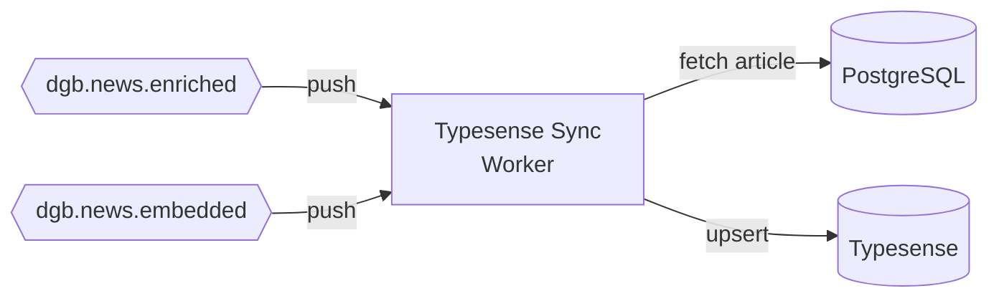

# Typesense Sync Worker

> Mantém o índice de busca Typesense sincronizado com o PostgreSQL em near-real-time.

## O que faz

O Typesense Sync Worker recebe eventos de artigos enriquecidos e com embeddings, busca os dados completos no PostgreSQL e faz upsert no Typesense. Opera em duas fases: primeiro com temas/resumo (sem embedding), depois atualiza com o vetor.

## Como funciona

### Fluxo em duas fases

**Fase 1 — Artigo enriquecido** (via `dgb.news.enriched`):

1. Recebe push, extrai `unique_id`
2. Busca documento completo do PostgreSQL
3. Upsert no Typesense (com temas e summary, sem embedding)
4. Artigo já aparece na busca full-text do portal

**Fase 2 — Embedding gerado** (via `dgb.news.embedded`):

1. Recebe push, extrai `unique_id`
2. Busca documento completo do PostgreSQL (agora com embedding)
3. Upsert no Typesense (atualiza com vetor 768-dim)
4. Artigo agora aparece também na busca semântica

## Onde mora

**Repo**: [`destaquesgovbr/data-platform`](https://github.com/destaquesgovbr/data-platform)

| Arquivo | Conteúdo |
|---------|----------|
| `src/data_platform/workers/typesense_sync/app.py` | FastAPI com `/process` e `/health` |
| `src/data_platform/workers/typesense_sync/handler.py` | `upsert_to_typesense()`, `fetch_news_for_typesense()` |
| `src/data_platform/typesense/client.py` | Cliente Typesense (parse `TYPESENSE_WRITE_CONN`) |
| `src/data_platform/typesense/indexer.py` | Lógica de indexação |
| `src/data_platform/managers/postgres_manager.py` | `PostgresManager` com connection pooling |

## Configuração

| Variável | Descrição |
|----------|-----------|
| `DATABASE_URL` | Connection string PostgreSQL |
| `TYPESENSE_WRITE_CONN` | JSON: `{"host": "...", "port": "8108", "apiKey": "...", "protocol": "http"}` |

!!! warning "TYPESENSE_WRITE_CONN vs TYPESENSE_HOST"
    O worker usa `TYPESENSE_WRITE_CONN` (JSON), não as variáveis individuais `TYPESENSE_HOST`/`TYPESENSE_PORT`/`TYPESENSE_API_KEY`. O client.py faz parse automático do JSON.

## Specs

| Config | Valor |
|--------|-------|
| **Cloud Run Service** | `destaquesgovbr-typesense-sync-worker` |
| **vCPU** | 1 |
| **RAM** | 512Mi |
| **Min/Max Instâncias** | 0/3 |
| **Timeout** | 300s |
| **Scale-to-zero** | Sim |

## Sync Batch (complementar)

Além do sync real-time, existem mecanismos batch para manutenção:

| Método | Comando/Workflow | Uso |
|--------|------------------|-----|
| **Incremental** | `data-platform sync-typesense --start-date YYYY-MM-DD` | Preencher lacunas |
| **Full reload** | `gh workflow run typesense-full-reload.yaml -f confirm=DELETE` | Reconstruir do zero |
| **Manutenção diária** | `typesense-maintenance-sync.yaml` (10AM UTC) | Sync dos últimos 7 dias |

## Idempotência

O upsert do Typesense é inerentemente idempotente — documentos com mesmo `unique_id` são sobrescritos.

## Links

- [Pipeline Real-Time](../arquitetura/pipeline-realtime.md) — Pipeline event-driven
- [Dados e Armazenamento](../arquitetura/dados-e-armazenamento.md) — Schema Typesense
- [Data Platform (docs principal)](https://destaquesgovbr.github.io/docs/modulos/data-platform)
