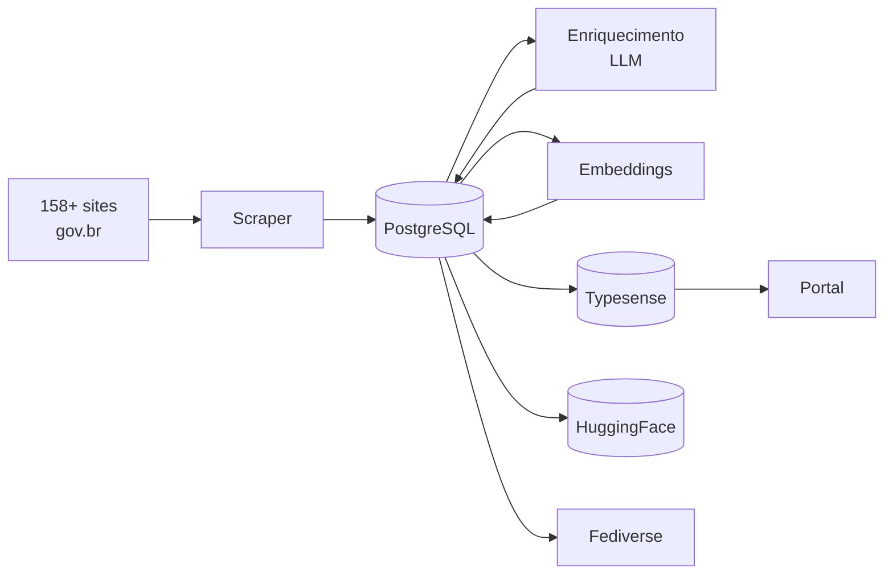

# Pipeline de Dados

> Documentação técnica unificada do pipeline de dados do **DestaquesGovBr**.

O DGB agrega notícias de **158+ órgãos** do governo federal brasileiro, enriquece com inteligência artificial (classificação temática e resumos) e disponibiliza em múltiplos canais: portal com busca semântica, datasets abertos no HuggingFace e publicação no Fediverse via ActivityPub.

## Visão Rápida

## Dois Modos de Operação

O pipeline opera em dois modos complementares:

| Modo | Latência | Tecnologia | Uso |
|------|----------|------------|-----|
| **Real-time** | ~5 segundos | Pub/Sub + Cloud Run | Novos artigos no portal |
| **Batch** | 15min a 24h | Airflow (Cloud Composer) | HuggingFace, Fediverse, scraping |

O modo **real-time** foi implementado em fevereiro/2026, reduzindo a latência de ~24h para ~5 segundos entre o scraping e a disponibilidade no portal. Veja [Pipeline Real-Time](arquitetura/pipeline-realtime.md) para detalhes.

Os processos **batch** continuam ativos para operações que são naturalmente periódicas (exportação de datasets, publicação no Fediverse, trigger de scraping). Veja [Pipeline Batch](arquitetura/pipeline-batch.md).

## Repositórios

O pipeline está distribuído em 6 repositórios, cada um com responsabilidade bem definida:

| Repo | Papel | Linguagem |
|------|-------|-----------|
| [`scraper`](https://github.com/destaquesgovbr/scraper) | Coleta de notícias de sites gov.br e EBC | Python |
| [`data-science`](https://github.com/destaquesgovbr/data-science) | Classificação temática e resumos via LLM | Python |
| [`embeddings`](https://github.com/destaquesgovbr/embeddings) | Geração de embeddings vetoriais | Python |
| [`data-platform`](https://github.com/destaquesgovbr/data-platform) | Sync Typesense, CLI, managers | Python |
| [`data-publishing`](https://github.com/destaquesgovbr/data-publishing) | Exportação para HuggingFace | Python |
| [`activitypub-server`](https://github.com/destaquesgovbr/activitypub-server) | Federação ActivityPub | Node.js |

Infraestrutura provisionada via Terraform no repo [`infra`](https://github.com/destaquesgovbr/infra).

## Navegação

- **[Arquitetura](arquitetura/visao-geral.md)** — Diagramas, fluxos e decisões de design
- **[Componentes](componentes/scraper.md)** — Referência técnica de cada serviço
- **[Operações](operacoes/monitoramento.md)** — Monitoramento, troubleshooting e runbooks
- **[Desenvolvimento](desenvolvimento/setup-local.md)** — Setup local e guia de contribuição

## Links Relacionados

- [Documentação principal do DGB](https://destaquesgovbr.github.io/docs/)
- [Pipeline Event-Driven (docs principal)](https://destaquesgovbr.github.io/docs/arquitetura/pubsub-workers)
- [Fluxo de Dados (docs principal)](https://destaquesgovbr.github.io/docs/arquitetura/fluxo-de-dados)
